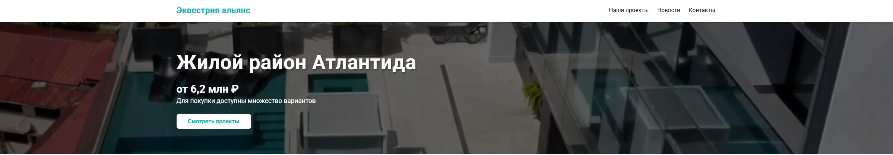
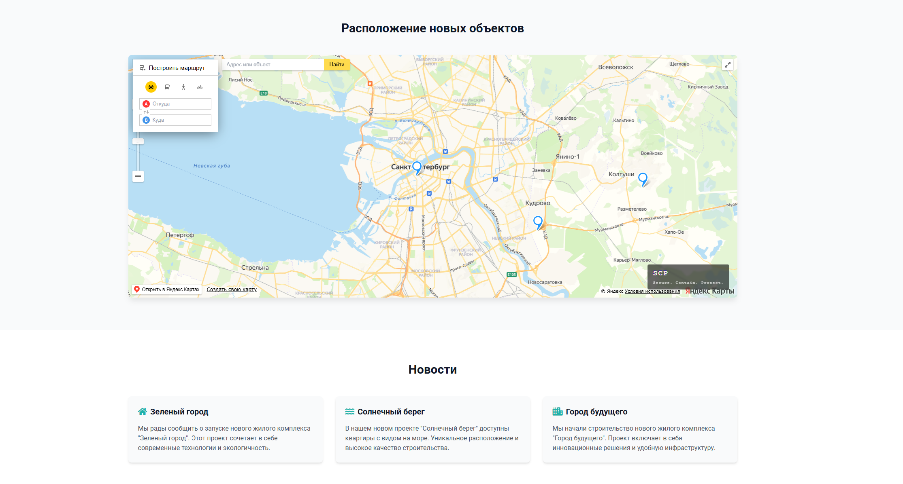
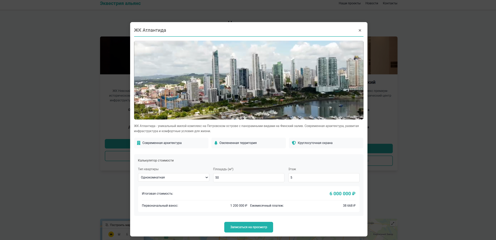

# 🏢 Эквестрия Альянс — Сайт застройщика (v2.0.1)

Веб-сайт корпоративного портала для девелоперской компании «Эквестрия Альянс». Платформа представляет собой современный лендинг с интерактивными элементами, каталогом жилых комплексов, ипотечным калькулятором и картой расположения объектов.

## 🌟 Основные возможности

- **Главная страница (Hero-блок):** Акцентное предложение по жилому району «Атлантида» с указанием стартовых цен и призывом к действию.
- **Блок «О компании»:** Отображение ключевых метрик (15+ проектов, 5000+ клиентов, 10+ лет на рынке), описание миссии и преимуществ компании.
- **Интерактивная карта:** Отображение расположения новых объектов с функцией построения маршрута и интегрированным поиском по адресам.
- **Каталог проектов:** Детальные карточки жилых комплексов (ЖК Невский, ЖК Атлантида, ЖК Василеостровский) с указанием площадей, комнатности, цен и кнопками быстрой консультации.
- **Ипотечный калькулятор:** Интерактивное модальное окно для расчета первоначального взноса и ежемесячного платежа в реальном времени.
- **Лента новостей:** Блок с актуальными обновлениями компании и ходом строительства (эко-проекты, новые очереди и т.д.).
- **Формы обратной связи:** Интегрированные формы для заказа звонка и консультации с валидацией данных.

## 🖥️ Скриншоты интерфейса

*Добавьте сюда скриншоты вашего сайта, когда загрузите проект на GitHub:*

<details>
  <summary>📷 Посмотреть скриншоты</summary>

  
  *Главная страница и акционный блок*

  
  *Интерактивная карта расположения*

  
  *Каталог жилых комплексов*

  
  *Поп-ап окно с расчетом ипотеки*

</details>
## 🛠️ Технологии

- **Frontend:** React.js / Vue.js / HTML5 / CSS3 (Tailwind CSS / Bootstrap)
- **Backend:** Node.js (Express) / Python (Django/FastAPI) / PHP
- **База данных:** PostgreSQL / MySQL
- **Библиотеки и API:** 
  - Яндекс.Карты API / Leaflet (для интерактивной карты)
  - Chart.js (для графиков и калькулятора)
  - jsPDF / SheetJS (для экспорта брошюр и расчетов в PDF/Excel)

## 🚀 Установка и запуск

1. Клонируйте репозиторий:
   ```bash
   git clone https://github.com/ВАШ_НИКНЕЙМ/equestria-alliance.git
   ```
2. Перейдите в директорию проекта:
   ```bash
   cd equestria-alliance
   ```
3. Установите зависимости (пример для Node.js):
   ```bash
   npm install
   ```
4. Запустите проект в режиме разработки:
   ```bash
   npm run dev
   ```

## 📄 Лицензия

Этот проект распространяется под лицензией MIT. Подробности в файле `LICENSE`.
```

